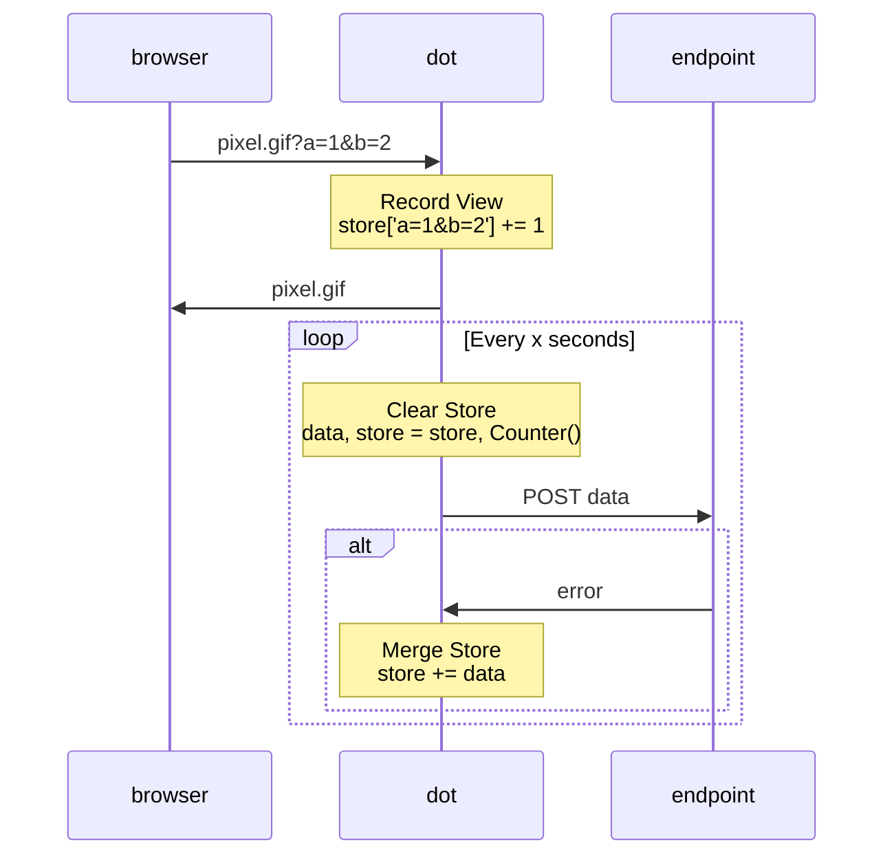

# Dot: Pixel Tracker

```mermaid
sequenceDiagram
    browser->>dot: pixel.gif?a=1&b=2
    Note over dot: Record View<br>store['a=1&b=2'] += 1
    dot->>browser: pixel.gif
    loop Every x seconds
        Note over dot: Clear Store<br>data, store = store, Counter()
        dot->>endpoint: POST data
        alt
            endpoint->>dot: error
            Note over dot: Merge Store<br>store += data
        end
    end
```
