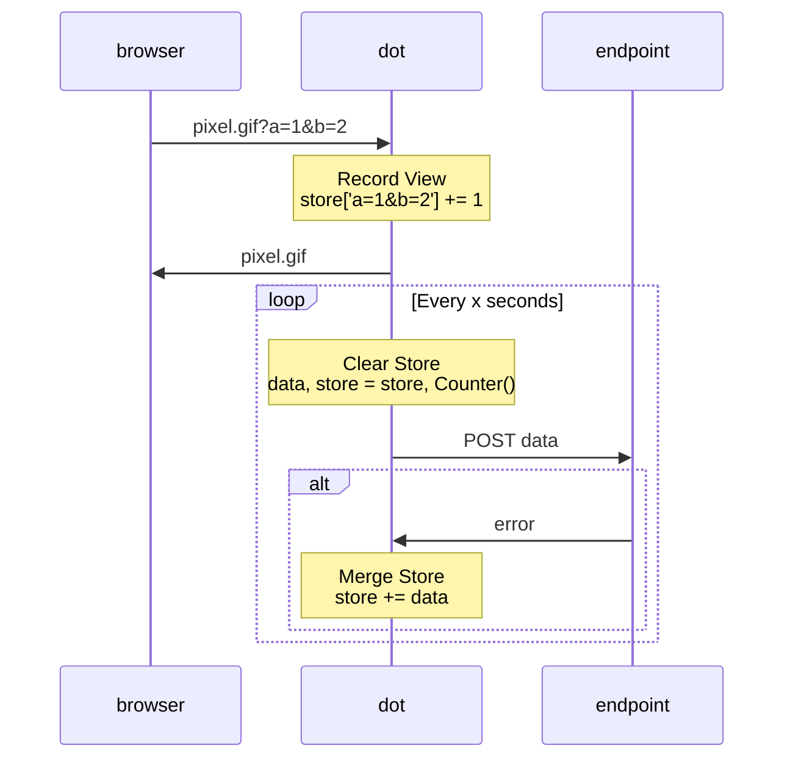

# Dot: Pixel Tracker

## Usage
### Requirements
* Docker
### Running Locally
```sh
# builds dot image & runs app container in your terminal
make dev

# run from a separate terminal to ping the dot container
make ping
```

## How it Works

